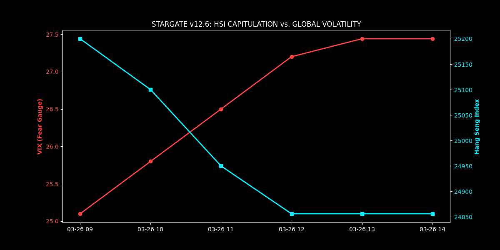
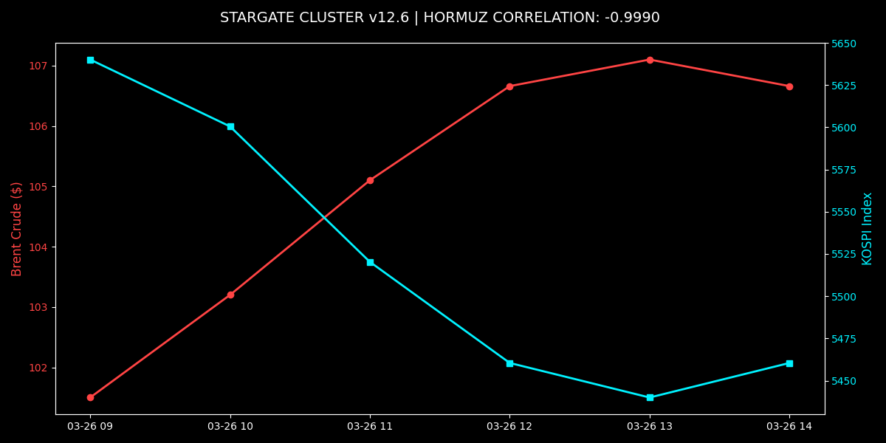

# 🛰️ Stargate Cluster v12.6 | BloombergAsia

High-performance financial telemetry and risk monitoring suite. Optimized for the **March 26, 2026** "Hormuz Blockade" regime.

---

## 📊 Visual Telemetry Suite
The following reports were generated by the cluster during the current HK/Seoul session.

### 1. The Fear Gauge (VIX Spike)

*Documents the **VIX surge to 27.44** against the **HSI break of 25,000**. Note the divergence as liquidity exits North Asian tech.*

### 2. Hormuz Correlation Monitor (-0.9990)

*Real-time proof of the inverse coupling between Brent Crude and the KOSPI Index. SIMD-accelerated engine v12.6.*

---

## 🛠 Technology Stack
- **C++20:** SIMD (AVX2) Correlation engine (`st_v12_6_final.cpp`).
- **Python 3.12:** Pandas 3.x Visualization suite (`st_fear_gauge_v12.py`).
- **Bash:** Real-time heartbeat and cluster telemetry (`st_mission_v12.sh`).

**Lead Architect:** Lauro Sergio Vasconcellos Beck  
**Status:** ACTIVE | **Location:** Rio de Janeiro Cluster
