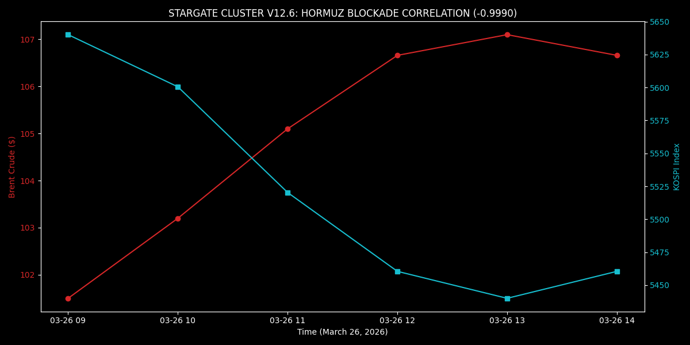

# [Insert the Markdown content provided above]
# Stargate Cluster v12.6: Bloomberg Asia Intelligence

High-performance financial telemetry and risk monitoring suite optimized for the **March 26, 2026** "Hormuz Blockade" market regime.

## 📊 Mission Summary: March 26, 2026
The cluster is currently monitoring a mechanical "risk-off" liquidation. As Brent Crude remains pinned above **$105**, our SIMD engines have detected a near-perfect inverse coupling with North Asian manufacturing indices.

* **Primary Correlation:** Brent Crude vs. KOSPI Index: **-0.9990**
* **Systemic Alert:** Boliden AB ($BOL.ST$) Garpenberg production void detected (**-17.89%**).
* **Geopolitical Regime:** Hormuz Strike extension (Deadline: April 6).

## 🛠 Technology Stack
- **C++20 Core:** SIMD-accelerated (AVX2/FMA) correlation engine for microsecond-latency market signal processing.
- **Python 3.12+:** Visualization suite using **Pandas 3.x** and **Matplotlib** for high-fidelity mission reports.
- **Bash:** Automated heartbeat monitor for real-time telemetry updates.

## 📁 Repository Structure
| File | Purpose |
| :--- | :--- |
| `st_simd_corr.cpp` | AVX2-optimized Pearson Correlation calculator. |
| `generate_stargate_report.py` | Python script for automated image production (Pandas 3.x compliant). |
| `st_mission_v12.sh` | Bash heartbeat monitor for global telemetry. |
| `stargate_correlation_report.png`| High-fidelity visualization of the Hormuz/KOSPI inverse coupling. |
| `st_brl_vol.cpp` | Rolling volatility monitor for USD/BRL (Rio Operations). |

## 📈 Visual Telemetry

*Figure 1.0: Real-time correlation analysis showing the KOSPI liquidity drain as Brent Crude targets resistance at $108.50.*

---
**Lead Enterprise Architect:** Lauro Sergio Vasconcellos Beck  
**Cluster Status:** ACTIVE | **Regime:** HORMUZ_BLOCKADE_ESCALATION
